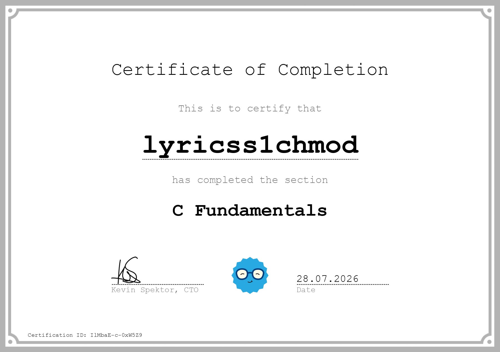
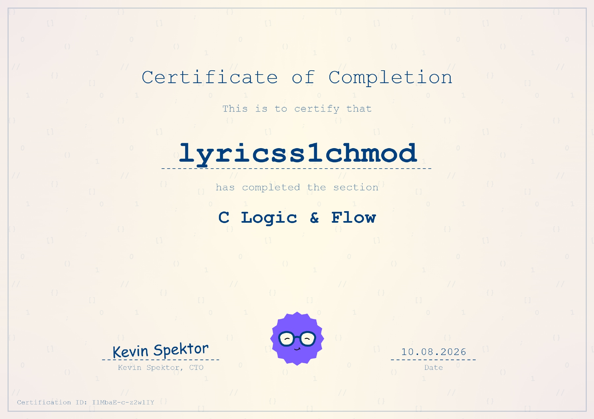

# C Learning

My C programming practice repo. Here I store course solutions, experiments, and custom code to understand low-level concepts.

## Purpose
* Learning C programming
* Understanding pointers, memory management, and low-level concepts
* Writing custom utilities and practice scripts

## Environment
* **Compiler:** `gcc`
* **OS:** Debian 13 trixie / Windows 11
* **Course source:** [coddy.tech](https://coddy.tech)

## Certificates

### Completed
* **C Fundamentals** — [Verify Certificate](https://coddy.tech/certifications/IlMbaE-c-0xW5Z9)
* **C Logic & Flow** — [Verify Certificate](https://coddy.tech/certifications/IlMbaE-c-z2wlIY)

### In Progress / Planned
* [ ] C Logic & Flow
* [ ] C Object Oriented Programming

* [ ] Terminal Introduction to **Docker**
* [ ] Terminal Version Control **Git**

* [ ] Assembly Fundamentals
